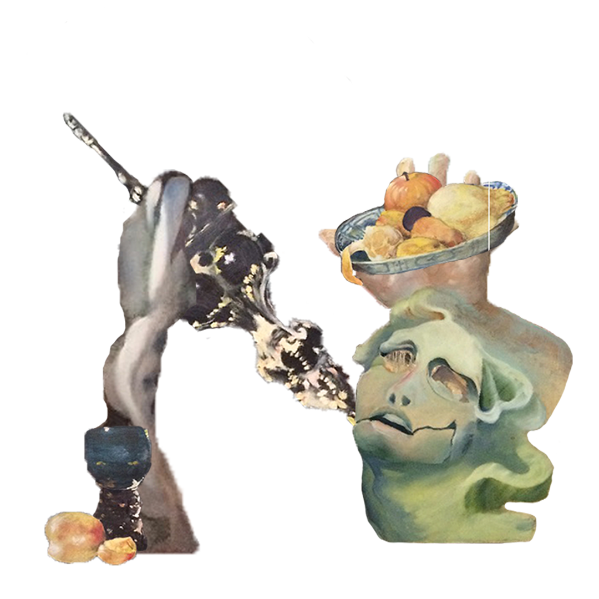

## Character & Description

*&*, Julie Natalie Smutna. Graphic artwork created in Adobe Photoshop.

- - -

**Alt text:** Picture is based on dark letter form N. Consist of parts of the paintings. On the right arm of the letter N is agony person that keep the blue plate with fruits. On the left arm of the letter N is glass with peach and grey cloth. Between two arms is something like candlestick.

### Process
I chose a letter N. N is connected with my second name Natalie. This name is meaning a reborn that I am feeling. I am reborn to the new thinking as a designer, new experience and new world at all. When i had a content I prepaired my artwork from my art portfolio. I made a collage from the letter N form. That is mix form two painting called "Hell and Heaven" and also "still-life". Painting "Hell and Heaven" is my own artwork. "Still-life" is painting that i copied from Willem Kalf. He is Flemish painter. I worked in Adobe Photoshop.

#### Keywords
- Letter N
- Reborn
- Collage
- Paintings
- Adobe Photoshop
