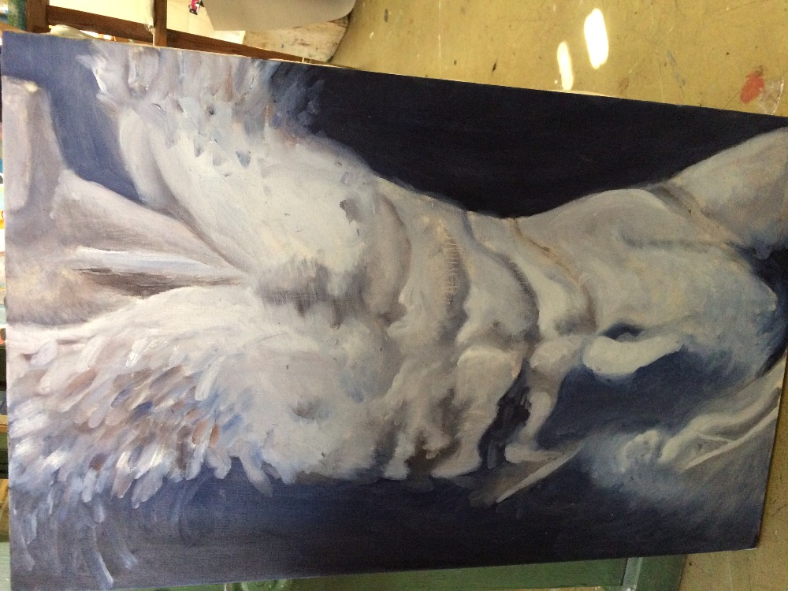
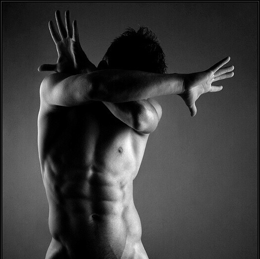
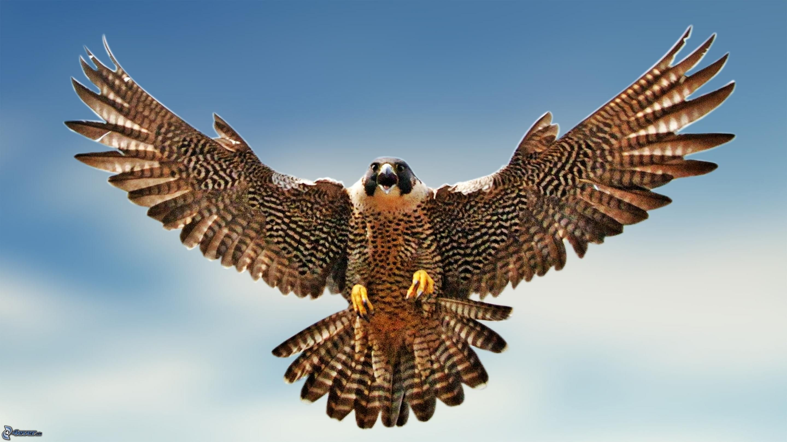
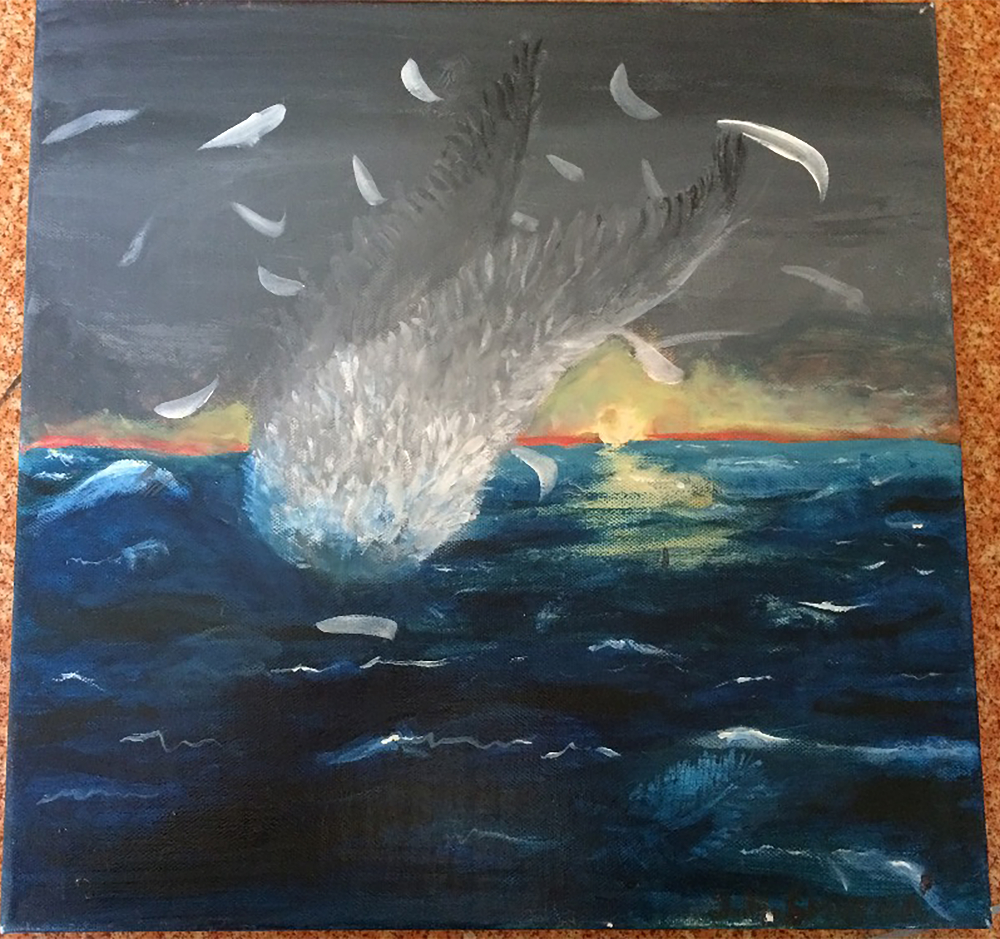
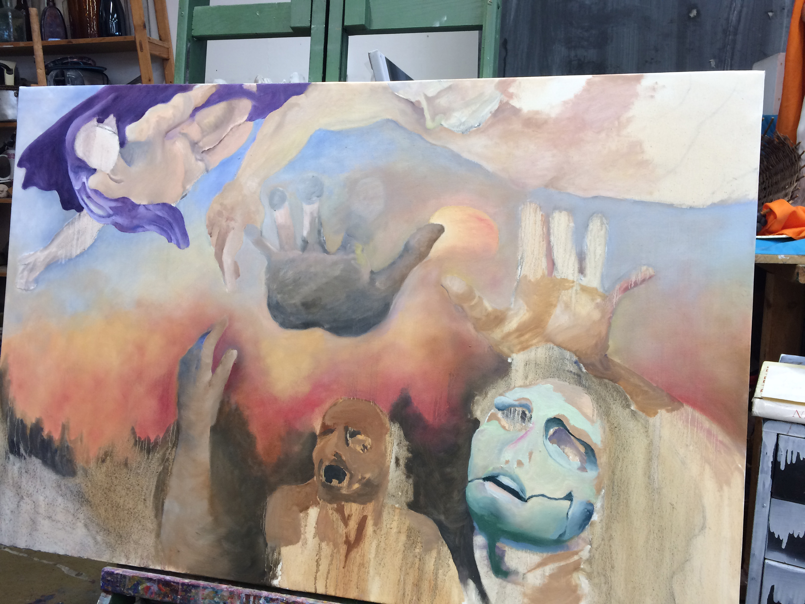
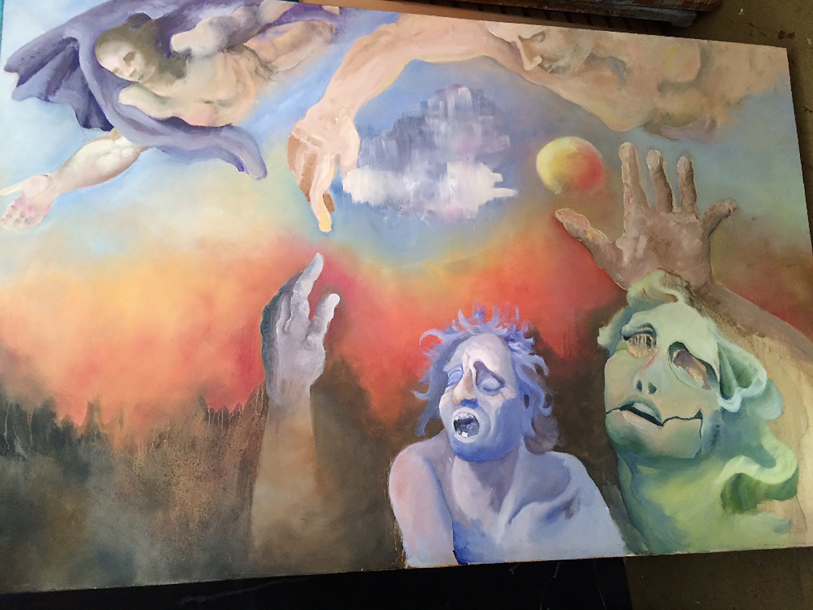

## VI
…
I copying for many parts of my artwork. But not exactly. I take just one part of inspiration and then I give them to my artwork. It’s part of creating for me. Maybe I copying a concept but I give my own story.

When I was younger, I loved unbelievable thing. Like horse in fire, flying on the space and also princesses too. I didn’t like colors but I loved contrast between black paper and silver or white pencil. One of my first drawing like that was horse with fire crest and tail. That was copying by Pokemon called Ponyta. I meet with Pokemon from my oldest brother that loved this card game.

### Figure 6-1 caption. Copying at high school

If I went at high school I started copying from a photos and drawings created by artists. For instance drawings from Rembrandt, Leonardo da Vinci, Egon Schiele, Michelangelo and many others. Masterpiece that I copied was homework. At first I copied just drawings and after year I copied a paintings, too. However, I needed an inspiration to create next artworks. We had interesting task for my art atelier. Like allegory of fertility, ghost ours time or reduplication. These themes to supported creative thinking. In this time created lots of my artwork ideas. My painting called “Metamorphosis” is composed by man stomach and wings from flying bird.

Inspiration from eagle combine with man's act. I took an inspiration from my homework name Falling Ikarus. 

This painting is inpired by fable about Ikarus who He did fall out to the ocean. When he had jumped from tower. I found a picture of the sea and than I painted it. We could to regard as copying. Artists are copying everyhing. They use something and then they give a another meaning.

This painting is composed by many different paintings and sculture from many different artists. Like Michelangelo's sinners and his angels and mans from his paintings. Cloud and sky was inspired by photos from Google. And hands are inspired by Dürer's drawings. In Fact, many of my artwork is copy from others artist.

### Figure 6-2 caption. Copying on University

Copying continued on college too. I think more then before on High school. I started to do a graphic design. What is different between graphic design and painting? Painting is like an Elephant that looks like similar as we know. With shades, eyes, skin and so on. Graphic design is like an elephant but just from bones. And it is more about copying. In graphic artwork I used techniques that did someone before me. I used a typography who someone create before me. We know now what is the best typography for digital version and what for reading printed version. I used a photography created by photographers. If I do a poster I usually do a collage from photos. Or I can drew my own artwork and mixed with photos. I found a inspiratin from other graphic designers and theirs artwork. Graphic design is all about transfomation.

I did a posters for Visegrad group. These posters are based on photos from freepic. It's webside when you can find an graphic and photographic tools for artwork that could you download for free. It's limited but you can download some tools with licence. It's good If you are only student. The first poster is inpired by cowboys and western freedom. And inspired by four riders of the apocalypse. I found a picture of western cowboy and graphic version of sun. I mixed it and made this visual.
