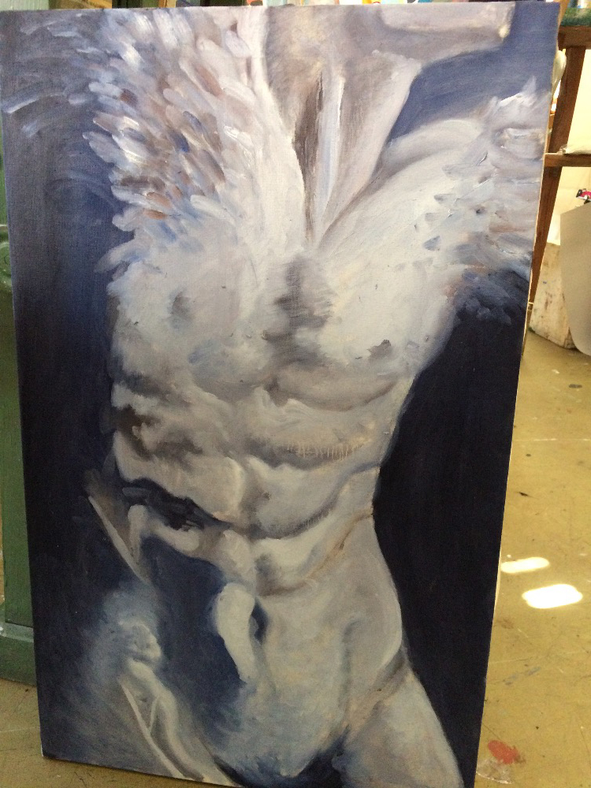

## VI
…
I copying for many parts of my artwork. But not exactly. I take just one part of inspiration and then I give them to my artwork. It’s part of creating for me. Maybe I copying a concept but I give my own story.

When I was younger, I loved unbelievable thing. Like horse in fire, flying on the space and also princesses too. I didn’t like colors but I loved contrast between black paper and silver or white pencil. One of my first drawing like that was horse with fire crest and tail. That was copying by Pokemon called Ponyta. I meet with Pokemon from my oldest brother that loved this card game.

If I went at high school I started copying from a photos and drawings created by artists. For instance drawings from Rembrandt, Leonardo da Vinci, Egon Schiele, Michelangelo and many others. Masterpiece that I copied was homework. At first I copied just drawings and after year I copied a paintings, too. However, I needed an inspiration to create next artworks. We had interesting task for my art atelier. Like allegory of fertility, ghost ours time or reduplication. These themes to supported creative thinking. In this time created lots of my artwork ideas. My painting called “Metamorphosis” is composed by man stomach and wings from flying bird.

Figure 6-1 caption.

Figure 6-2 caption.
