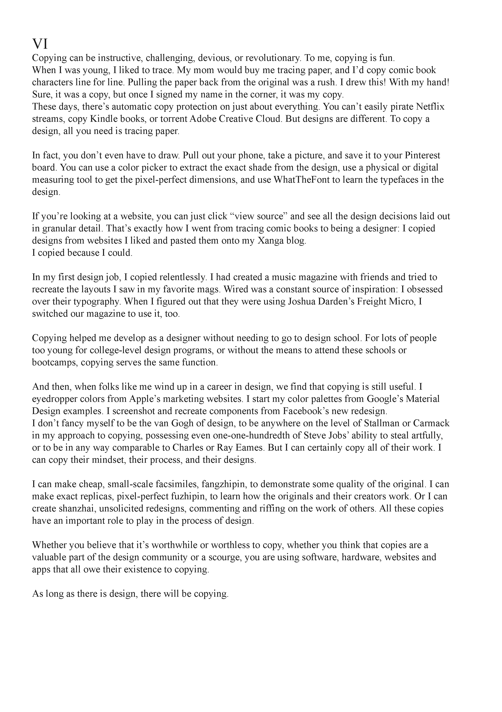

## Writing Style

 - Respect. - Treat readers with the respect they deserve. Put yourself in their shoes, and don’t patronize them. Remember that they have other things to do. Be considerate and inclusive. Don’t market at people; communicate with them.
- Guide. - Think of yourself as a tour guide for our readers. Whether you’re leading them through our educational materials or a task in our app, communicate in a friendly and helpful way.
- Speak truth. - Understand Mailchimp's place in our users’ lives. Avoid dramatic storytelling and grandiose claims. Focus on our real strengths.

- Clear. - Understand the topic you’re writing about. Use simple words and sentences.

## voice

1. We are genuine. - We get small businesses because we were one not too long ago. That means we relate to customers’ challenges and passions and speak to them in a familiar, warm, and accessible way.

2. Our humor is dry. - Our sense of humor is straight-faced, subtle, and a touch eccentric. We’re weird but not inappropriate, smart but not snobbish. We prefer winking to shouting. We’re never condescending or exclusive—we always bring our customers in on the joke.

3. Personality. - He use a words that is playfull, cheeky and fun. He is personal and active interesting words.

## Tone

Write positively. Use positive language rather than negative language.

