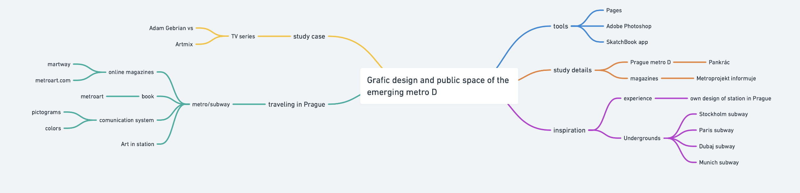

# Grafic design and public space of the emerging metro D

The thesis is about art in the subway in Prague. The theoretical part is based on the design in the metro. The art design interior had just ten stations. Pankrác, Olbrachtova, Nádraží Krč, Nemocnice Krč and Nové Dvory. Other stations haven't art visualization. And also about logo and typography that are used. Inspiration from other countries. Like Paris, Stockholm, Dubai, etc. There is one part dedicated to Adam Gebrian TV series about architecture and Prague metro. The practice part of the thesis is about my opinion, inspiration, design interior, graphic design, and art in the station Depo Písnice. In my opinion, the metro in Prague needs a better information system that is connected with visuals aids.

<!-- Note the inclusion of an empty line break after the summary element for formatting. -->

  
Mind Map

  

### Voice and tone

<!-- For example. See Recap section links for review. -->

- **Voice:** Profesional, confident, educated, and informativeness.
- **Tone:** Formal (academic), enthusiastic,creative and intelligent.

## Outline
1. Competition - My thesis began with a start competition for the visual realization in the metro D. New metro line in Prague. David Vávra is a architecture that chosed winners of the competition. With Michal Novotný, Manager of National Gallery.
2. Jiří Černický - is a Czech artist and sculptor. Author many Installation, Performance and Public Art. He is otherwise known as an artist around the world. He uses lots of materials and techniques in his artworks. He has four visual art for the station Nemocnice Krč. The first is inspired by hospital technologies that modern medicine used. The material of the visual is stained glass and lights in the station. Mr. Černický comes with a wheel. Universal shape for stained glasses. The second is inspired by Jules Verne 20 000 leagues under the sea. All station is composed by roentgen of animals. Animal because humans roentgen is a little bit morbid. The third visual is inspired by the cave and the fourth one is inspired by the medicine technique too. The fourth visual will be realized.
3. Metron - is a typography designed for metro in the Prague only. It is used for name's of stations. Created by designer and typographer Jiří Rathouský in 1973.
4. Logo of Prague metro - designed by Jiří Rathouský with an arrow, Petr Tučný with geometric shapes, Jaromír Windsor with his raven, Miloš Voldřich with redesign raven, studio Jerome with a redesign of the arrow from Mr. Rathouský, Studio Báze 3 with a redesign from studio Jerome. Typography in Prague metro has lost of changes and has a long history.

### Notes
- Competiton for a visual of station on line D
- Jiří Černický and his visualization for station Nemocnice Krč
- Prague and line D
- Typography - Metron
- Logo of Prague metro
- Libretto of line D
- Adam Gebrian in Prague
- About others stations that had had visualization
- The most beautiful station around the world - Munich, Paris, Dubai a so on.
- Inspiration for my own station Depo písnice
- Two different type of my design
- New bench and rubbish bin
- New sign and digital sign
- Typography - Neue Helvetica
- Logo
- Pictograms
- Lights and materials

## Keywords

- **Prague metro D**
  - New metro line in Prague; Metro is one of the public travelings that is very comfortable and fast. You can travel throw Prague for less than 30 minutes. Prague has three functions metro line called A, B, C, and will be another line D.
- **Jiří Černický**
  - A Czech artist and sculptor; Author of the fourth visual for the station Nemocnice Krč.
- **Typography**
  - Metron/Neue Helvetica; Prague subway using four types of typography. With anarchy system of using. Helvetica, DIN, Syntax, Metron
- **Information system**
  - Sign and digital sign; The information system is important to orientation in the underground. 
- **Lights**
  - Stained glass, chandeliers, ; aim for a single-sentence in 120 characters or less.
 
 ### References
 
 <!-- Consider reference style for textual works, data sets, and audiovisual and online media. -->
 
 - [MHD information metro D](https://www.dpp.cz/metro-d) - just in Czech language
- [Art in Prague metro.](http://metroart.cz/index.html)
- [Station Khalid al bin Waleed](http://www.lasvit.com/project/the-dubai-metro-2/#intro)
