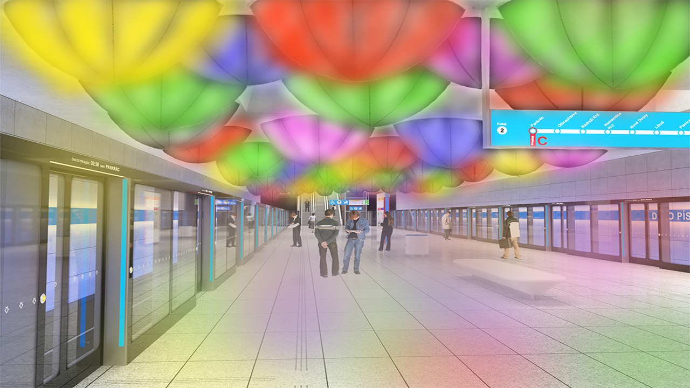

<!-- Add an *optional* hero image to provide visual context. -->

# Grafic design and public space of the emerging metro D

<!-- Content goes here… -->
The main idea of my thesis is How could work visual element connect with grafic design in public spaces. Metro doesn't just a means of transport. It's a public space that you can see, waiting for metro and go.

I created a visual design for station Depo Písnice. Inspired by Dubai, Paris, Munich and many other contries. I described informatin and navigation system in Prague metro and comment it. Like logo, typography, warning sign and so on. In fisrt design I used materials that is very easy for cleaning, using and instalation. In second design has easy design too. But needed more materials and more approvals like fire situations etc. But, I spoke with specialist and he said that wouldn't be problem.

## Keywords

Visual realization, metro D, Akad. arch. David Vávra, prof. doc. Mgr. akad. mal. Jiří Černický, information system, navigation system, Prague subway, typography, pictograms, Ing. arch. Adam Gebrian, foreign subway, visual element, Ing. Eugen Maletič

## Motivation/Problem and/or Opportunity

I knew new information about Prague metro and about vizual style for new line D. One of the most interesting realization is create by Jiří Černický. And also many others artists. I inspired by the subways from Paris, Dubaj, etc. I met the specialist for lights. I needed a consultation of my own practice part of thesis.

## Thesis

The bachelor's thesis is about visual element connect with grafic design in the subway in Prague. The theoretical part is base on the design in the metro. About logo and typography that are use for Prague metro. Inspiration from other countries. Like Paris, Stockholm, Dubai, etc. There is one part dedicated to Adam Gebrian TV series about architecture and Prague metro. The practice part of the thesis is about my opinion, inspiration, design interior, graphic design, and art. In my opinion, the metro in Prague needs a better information system that is connect with visuals aids.

## Approach/Methodology

In theoretical part is about Prague metro, graphic design, and art. It's about Jiří Černický that he did visual design for station Nemocnice krč. Adam Gebrian looking at to the Prague metro by critik eyes in his TV series. Typography, sign, logo, and information system. Inspiration by other countries at the theme art in subway. How I could do to do it? In practical part is about my visual design connected with the information system. I created visuals elements that could help with information and navigation in the station. And then I asked for more information from the specialist about it.

## Results/Outcomes/Analysis

I redesigned colors from my design after the interview with Mr. Maletič.

## Conclusion

The realizations stations of subway in Prague are analysis. I created my own visual design for station Depo Písnice to help by critical eyes by architects, jurymen, critics, and artists. Station Depo Písnice hasn't a visual style now. It's like the information and navigation system of Prague. This spring will be competition for information and navigation system for public transport in Prague. It is same for all type of traffic.

Mr. Černický and other artists have a very beautiful and useful design. Thanks to the TV series by Adam Gebrian I got some information about the visualized stations. Is important to have one style in graphic design that needed to adhere.
