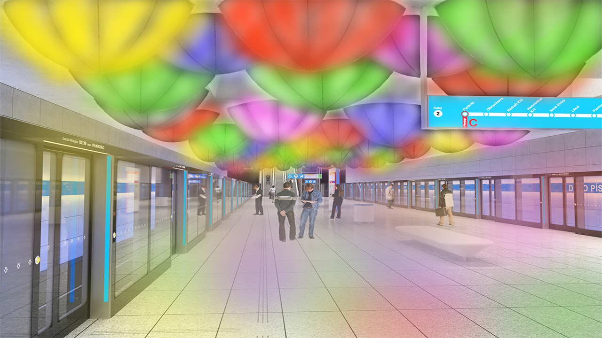
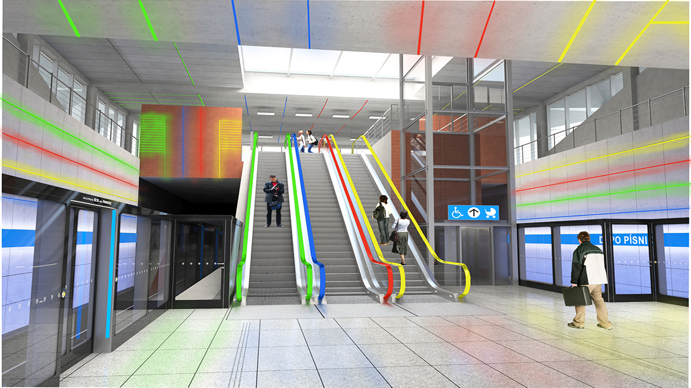

<!-- Add an *optional* hero image to provide visual context. -->

# Grafic design and public space of the emerging metro D

Byline

16.4.2021

<!-- Content goes here… -->

## Abstract

In theoretical part is about Prague metro, graphic design, and art. It's about Jiří Černický that he did visual design for station Nemocnice krč. Adam Gebrian looking at to the Prague metro by critik eyes in his TV series. Typography, sign, logo, and information system. Inspiration by other countries at the theme art in subway. How I could do to do it? In practical part is about my visual design connected with the information system. I created visuals elements that could help with information and navigation in the station. And then I asked for more information from the specialist about it.

### Keywords

Visual realization, metro D, Akad. arch. David Vávra, prof. doc. Mgr. akad. mal. Jiří Černický, information system, navigation system, Prague subway, typography, pictograms, Ing. arch. Adam Gebrian, foreign subway, visual element, Ing. Eugen Maletič

## Article

<!-- Expanded article based on outline. -->
