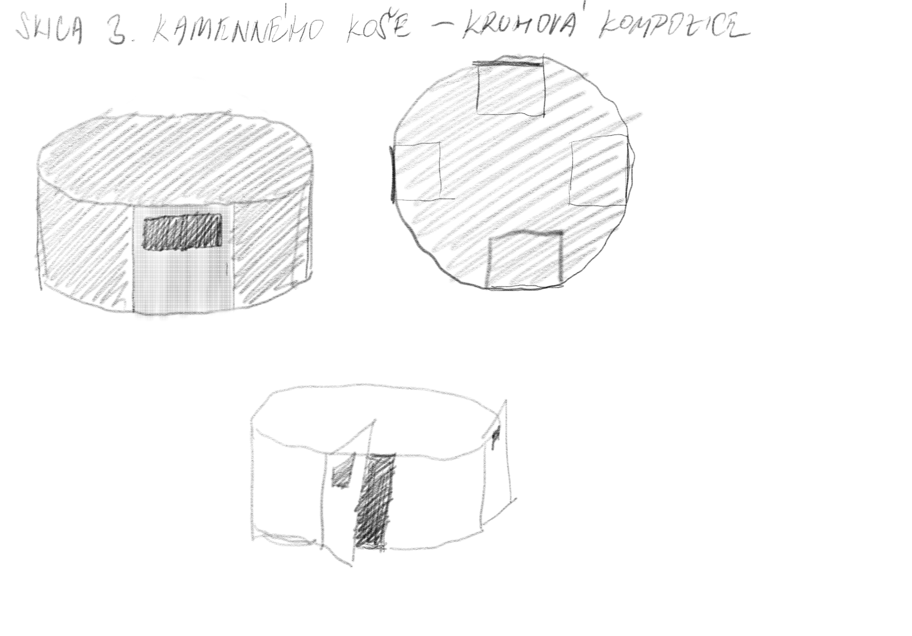
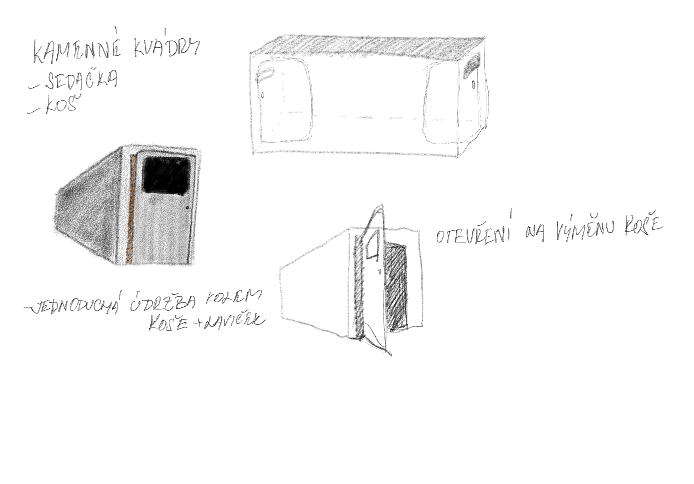

<!-- Add an *optional* hero image to provide visual context. -->

# Graphic design and public space of the emerging metro D

25.4.2021

<!-- Content goes here… -->

## Abstract

In theoretical part is about Prague metro, graphic design, and art. It's about Jiří Černický that he did visual design for station Nemocnice krč. Adam Gebrian looking at to the Prague metro by critik eyes in his TV series. Typography, sign, logo, and information system. Inspiration by other countries at the theme art in subway. How I could do to do it? In practical part is about my visual design connected with the information system. I created visuals elements that could help with information and navigation in the station. And then I asked for more information from the specialist about it.

## Final abstract

The bachelor thesis concerns the visual and graphic concept of the interior of a metro station on the D line. The theoretic part is based on the announced results of the competition regarding the visual identity of stations on this new metro line. The designs are related to all five selected line D stations. This part of the thesis involves all general components of the information and navigation system. The basic spectrum of elements showcased in the reports is complemented by the critical view, not just on the construction and the visual aspect of the implemented stations, but also includes other unimplemented concepts of the interiors’ visual designs. It is accompanied by foreign implementations, whose insights in functionality and aesthetics were significant for the actual construction of Prague’s metro, too. The practical part is focused on the creation of the author’s own concept, intended for one of the other stations yet to be built. Additionally, it is complemented by street furniture design adapted to the visual style of the station. Important criteria valued especially in practice are the sustainability of the used materials and the practicality of selected visual elements. The thesis is concluded by an interview with Ing. Maletič, a technical expert on the illumination of interior and exterior spaces.

#### Keywords:

Visual realization, metro D, Akad. arch. David Vávra, prof. doc. Mgr. akad. mal. Jiří Černický, information system, navigation system, Prague subway, typography, pictograms, Ing. arch. Adam Gebrian, foreign subway, visual element, Ing. Eugen Maletič

## Article

### About my design of benches and waste bin

It's began with skatches by benches and waste bin.

